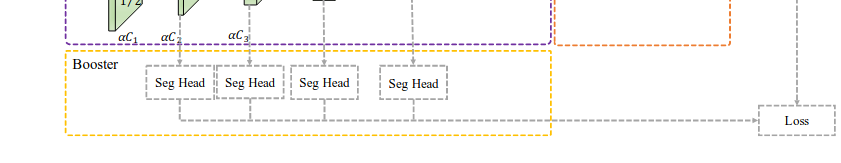

# отчет на 16.12.22

В отдел видеоаналитики поступил вопрос от отдела perseption в лице Тамерлана Беслановича:    
Почему onnx модель сетки в segmentation_trt имеет 5 выходов?   
Для ответа на вопрос начал изучать статью авторов архитектуры нейросети.   

Данные 4ре выхода являются boostовой частью архитектуры отходящих от семантической   
магистральной ветки и используются при обучение для формирования ошибки   
после прохождения итерации обучения на batche.    
  

Также данная информация была уточнена у разработчика segmentation_trt Александра Крапухина.  
Был получен ответ что эти выходы используются только во время обучения. Когда модель переносится   
на тензоррт, они игнорятся и у квантованной модели их уже нет
